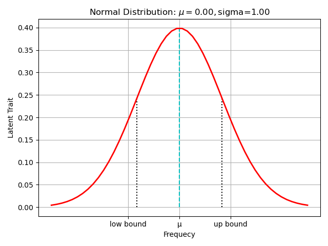
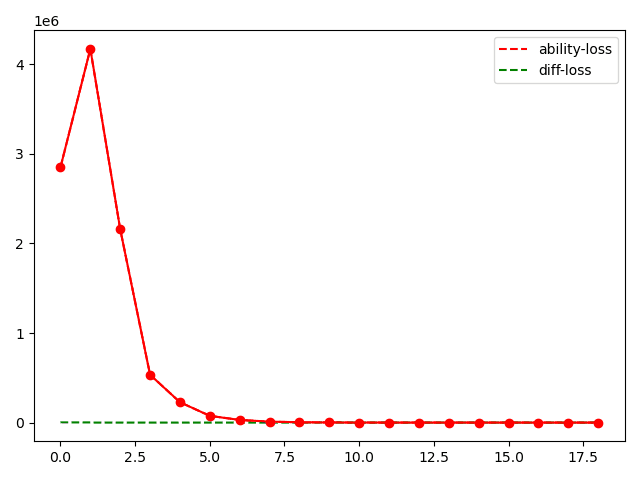
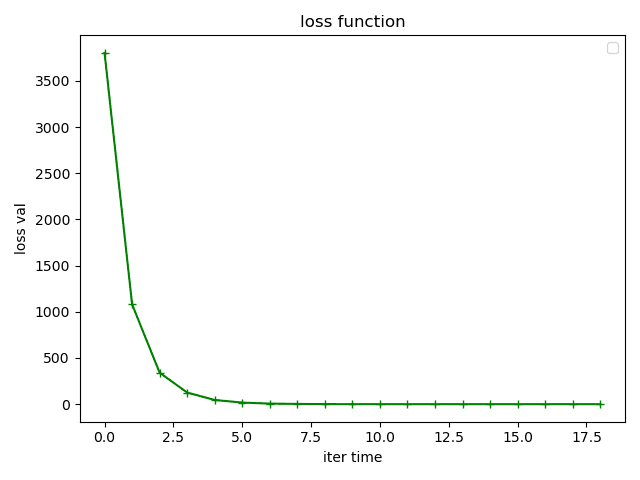
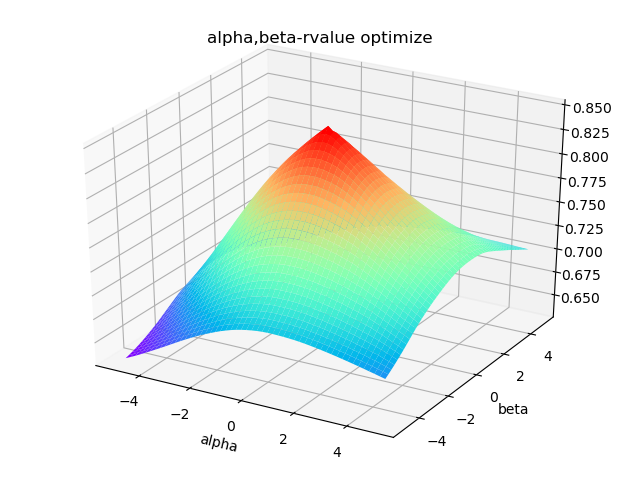
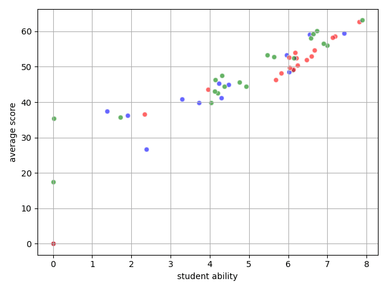
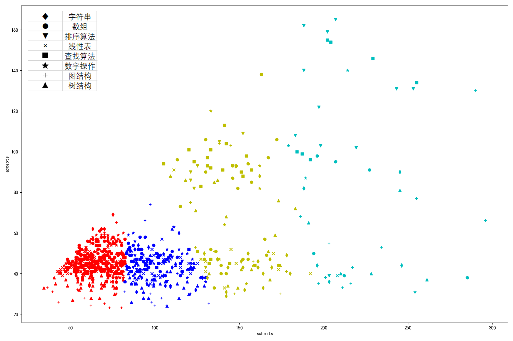
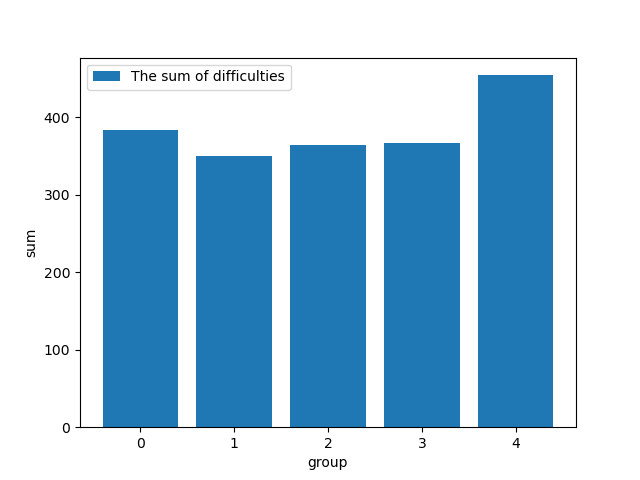

# 多维视角下编程OJ综合评估改进

## 目录

[toc]

## 1. 基本信息

> 本报告由小组三人共同完成

### 1.1 小组成员

| 姓名   | 学号      | 邮箱                       | Python练习完成数 | 分工     | GitHub用户名 |
| ------ | --------- | -------------------------- | ---------------- | -------- | ------------ |
| 陈彦泽 | 181250015 | 181250015@smail.nju.edu.cn | 147              | 数据处理 | Cpaulyz      |
| 程荣鑫 | 182150021 | 181250021@smail.nju.edu.cn | 200              | 代码编写 | Sparrow612   |
| 庄子元 | 181830266 | 181830266@smail.nju.edu.cn | 200              | 数学建模 | NIL-zhuang   |

## 2. 摘要

编程OJ目前被广泛应用在学生的代码能力评估上。传统OJ是单纯的基于代码测试得分计算，存在较多缺陷。本小组利用约250名软院学生对1000道python题的提交数据，通过对面向用例、非Python代码提交等作弊代码的剔除，代码行数和运行时间综合评测学生代码能力，使用马尔科夫链模型，以很高的收敛速度进行迭代计算，获取题目的难度和学生的综合代码能力。

从PCA分析可知，在对于学生的编程能力上，字符串能更显著的反映学生的实际编程能力。在K-Means聚类分析中也能发现，字符串的显著性，以及学生树结构、图结构等较难题型上缺乏训练和耐心，不愿意尝试等现状。在相关性计算上，我们发现学生的编程能力和在算法题上的提交次数具有极强的相关性。

对于当前的MOOCTest系统，需要取消题目分组，将题目随机分配，以消除组间差距，提升评估效果。

**关键字**：编程能力评估，马尔科夫链，PCA，K-Means, 相关性计算

## 3. 前言

### 3.1 研究背景

编程OJ（Online Judge）是评估学生对编程语言的掌握能力、逻辑思维能力等的重要方式，目前被普遍用于各类测试、练习和竞赛中。对学生编程能力进行合理高效的计算对衡量学生编程能力，分配训练题目等都有着重要的应用价值。

南京大学2018级软件学院约250名同学在2020春季学期的数据科学基础课上，基于MoocTest平台，分为5组完成了总计近1000道python编程题。

从收集到的提交数据中，可以获得每名学生每个题目的最终得分、提交记录、题目类型、上传时间、提交代码包，从提交代码包中还可以获得该题目测试用例，计算出运行时间、代码行数等数据。

### 3.2 研究现状

通过对数据进行采样分析、采访部份同学等方式，我们发现在编程OJ中，存在如下一系列影响评估的行为：

1. 碍于编程题目的原创性低，部分同学利用搜索引擎在leetcode, codeforce, geekforgeeks，poj等各大OJ平台上找到类似的原题，并抄袭题解以期提高得分，以使用C++/C语言提交
2. 由于MoocTest平台以编程训练为旨，会给学生错误答案的实时反馈。部分学生利用此特性编制面向测试用例的代码，来绕过代码逻辑，获得评测分数。
3. 题目的选择和分配没有难度区分，不同组别、不同学生之间题目相差较大。难以用初始得分评估学生的编程水平

现有评价体系以学生题目作答数作为评分标准，难以察觉上述影响评估的行为，难以保证公平性与有效性。

### 3.3 研究问题

通过对提交数据的解析，可以获取以下有效数据：原始最终得分、提交代码、测试用例，通过本地运行后可获得运行时间、代码行数。

为了修正现有评价方法存在的不足，我们以多维角度对学生能力进行评价，并同时对题目难度进行评估。

针对学生，我们期望评价其能力值。学生每做一道题会对其能力值带来提高，其提高程度与原始得分、面向用例通过比例、运行时间、代码行数有关（提交次数也应是重要的影响因素，但因平台仅收集学生”提交“次数而非”运行“次数，考虑到学生做题习惯的差异，部分学生习惯多次”运行“至满分后才”提交“，部分学生习惯每次“提交”，因此误差较大，故不考虑）。

针对题目，我们无法从数据集中提取题目难度，期望评价其难度。题目难度与该题的作答率、最终成绩、作答学生的能力值有关。

该研究问题大致可应用于以下场景：

1. 可对学生能力进行更精准的评价
2. 可对题组中的题目难度进行定量分析
3. 可获取学生针对某一类型题目的能力
4. 可对比学生对各个类型题目解答能力差异

## 4. 研究方法

对于所给数据，首先通过面向用例排查、非Python提交的数据清洗剔除非法提交，使用运行时间、代码行数等多维数据修正实际得分，让得分能更好的反映学生的综合代码能力。然后基于学生代码能力-题目难度，使用马尔科夫链反复迭代得到最终收敛的各组题目难度-学生代码能力。

使用PCA主成分分析研究题目，发现字符串对实际编程能力的评估是较为显著的；使用K-Means聚类法研究题目的提交-通过率和题目类型的关系，发现字符串等类型的题目更适合当前学生对编程题的选择倾向，而对树结构、图结构等题倾向于跳过或放弃，呼应了PCA的结果；使用相关性分析检查学生的提交数和综合能力之间的关系，利用假设检验检查其显著性。

更多详见下面👇的内容。

### 4.1 数据预处理

1. **分组**

	我们对数据集进行了分组，依据是"同组的同学做的题目是相同的"，还原原本的分组情况，以便后续的数据分析。有了学生的分组，每组的题目也自然就有了。这部分的代码在代码解释部分有提及。

	同时我们也借此发现，题目分布比较稀疏。

	下为题目频率分布直方图

	

	当然，分组中我们也发现几位同学的信息非常奇怪，做的题目不属于任何一组（可能是某些注册后弃用的账号，户主重新注册了一个账号做题，也可能是做题中途修改了组信息），这样的数据无助于我们后续的分析，数目也不是很多，我们直接将它们剔除。后文数据集无特别声明皆不包含这些数据。

	```
	student 3544 分组失败 所做题目为: ['2908', '2172', '2179', '2176', '2307', '2804', '2908', '2456', '2450']
	student 51584 分组失败 所做题目为: ['2190', '2061', '2505', '2309', '2584']
	student 47329 分组失败 所做题目为: ['2498', '2791', '2790', '2789', '2800', '2822', '2821', '2820', '2809', '2808', '2829', '2807', '2806', '2828', '2827', '2805', '2804', '2826', '2825', '2847', '2803', '2846', '2802', '2812', '2811', '2833', '2799', '2810', '2798', '2795', '2794', '2818', '2839', '2817', '2816', '2814', '2813', '2793', '2792', '2801', '2788', '2787', '2786', '2797', '2785', '2796', '2784', '2783', '2819', '2815', '2870', '2867', '2845', '2823', '2844', '2866', '2865', '2843', '2864', '2842', '2863', '2840', '2861', '2849', '2848', '2868', '2824', '2834', '2877', '2855', '2854', '2832', '2875', '2831', '2853', '2830', '2852', '2873', '2851', '2872', '2850', '2819', '2838', '2859', '2837', '2815', '2836', '2858', '2835', '2857', '2891', '2890', '2889', '2922', '2888', '2921', '2887', '2920', '2886', '2885', '2841', '2884', '2862', '2883', '2882', '2860', '2929', '2928', '2927', '2926', '2925', '2869', '2924', '2923', '2881', '2880', '2878', '2856', '2911', '2910', '2876', '2930', '2874', '2871', '2918', '2917', '2916', '2915', '2914', '2913', '2879']
	student 60598 分组失败 所做题目为: ['2438', '2701', '2179', '2442', '2176', '2061', '2307', '2127', '2180', '2909', '2176', '2900', '2955', '2898', '2985', '2952', '2896', '2740', '2178', '2906', '2904', '2947', '2958', '2209', '2934', '2747', '2671', '2197', '2195', '2194', '2192', '2207', '2669', '2206', '2668', '2205', '2667', '2204', '2665', '2202', '2543', '2201', '2662', '2189', '2562', '2661', '2187', '2658', '2656', '2655', '2653', '2651', '2673', '2659', '2430', '2793', '2792', '2494', '2692', '2372', '2293', '2801', '2427', '2602', '2788', '2468', '2787', '2523', '2467', '2489', '2522', '2786', '2500', '2741', '2785', '2564', '2542', '2784', '2442', '2783', '2729', '2528', '2429', '2428', '2527', '2285', '2284', '2282', '2436', '2456', '2533', '2797', '2433', '2796', '2211', '2819', '2739', '2815', '2738', '2737', '2539', '2149', '2115', '2148', '2125', '2147', '2146', '2168', '2167', '2220', '2152', '2151', '2150', '2133', '2155', '2154', '2132', '2230', '2131', '2153', '2130', '2107', '2129', '2128', '2227', '2226', '2102', '2223', '2245', '2101', '2123', '2240', '2161', '2160', '2218', '2118', '2215', '2138', '2137', '2159', '2158', '2136', '2157', '2135', '2112', '2156', '2219', '2298', '2375', '2296', '2294', '2492', '2391', '2292', '2306', '2405', '2404', '2304', '2446', '2302', '2308', '2406', '2460', '2459', '2415', '2458', '2435', '2457', '2710', '2434', '2378', '2455', '2432', '2431', '2439', '2448', '2535', '2444', '2443', '2387', '2397', '2440', '2495', '2491', '2490', '2538', '2451', '2450', '2461', '2449', '2515', '2514', '2536', '2525', '2601', '2634', '2513', '2579', '2578', '2445', '2464', '2541', '2517', '2506', '2604', '2516']
	student 61097 分组失败 所做题目为: ['2340', '2688', '2686', '2684', '2593', '2940', '2939', '2225', '2702', '2576', '2575', '2630', '2773', '2500', '2399', '2503', '2502', '2508', '2666', '2663', '2672']
	student 34511 分组失败 所做题目为: ['2797', '2796', '2793', '2792', '2215', '2584']
	```

2. **面向用例排查**

   所谓面向用例，就是如下的代码：

   ```python
   if input == 10:
     print(21312312)
   elif input == 15:
     print(453533)
   ```

   我们一共想到三种可行的面向用例排查方式：

   1. 用例输入输出的文本匹配

   2. 代码行数异常

   3. 大量连续的if-else语句块

   先说结论，我们认为比较可行的是第一种。

   第二种代码行数异常是建立在"面向用例完成题目的代码一般比正常完成的代码行数少很多"的假设上的，但是不排除有这样的情况，即原本的正常流程代码行数也不多，和“面向用例”方式差别不大，这种情况便无法区分了；还有的情况比如，用户并不完全面向用例，只是用这种方式过个别无法通过的用例，这种情况下代码行数也是跟正常代码相差无几的，所以方法2不可行。

   再说方法三，用这样的方法时，无法与本身就用上大量if-else的代码相区分，容易造成误判。其次，“大量”这个词语很难量化，连续5个？10个？用什么作为依据确定呢？如果用户不是连续使用if-else的呢？就像我们前面说到的，面向用例不全是一股脑的整体都if-else过，可能被用来对付个别用例，所以方法三和方法二一样不可行。

   方法一虽然也有预判的情况，但没有法二法三那么严重。比如这样的代码

   ```python
   print('YES')
   ```

   题目的答案是枚举值‘YES’和‘NO’，那么代码中一定一定会出现类似的文本，但这类题目比较少，也方便针对，就结果来看，对整体的影响不是很显著，所以我们最终采用了方法一。

3. **非python提交数据清洗**

   提交中居然有用cpp的，我们发现这一点的时候也是非常惊讶。可能原因是部分题目有各大OI选手在网上贴出的cpp版答案。

   cpp的清洗非常方便，cpp的启动离不开main函数，我们只需在代码中检查是否有“int main”或者“void main”之类的词就行了。python的main写法与cpp不同，所以不会造成误判，正常的python代码中也不会出现上面两句。

   这部分提交占总体相当少，影响不显著。

4. **运行时间、代码行数多维分析**

    编码的简洁性是衡量代码能力的重要方式。Tim Peters在*The Zen of Python*中强调，*Simple is better than complicated*，Python代码被推崇的重要原因之一，就是因为它完善的包管理机制和丰富的第三方扩展包，大大提高了python代码的表达力和简洁性。同时python的许多语法糖，例如生成式列表、lambda表达式等，都用来简化代码行数，提高可读性。代码行数是衡量对python第三方包、内置语法糖等了解程度的一个重要衡量因素，也就是说对python越熟悉，语言越*Pythonic*，代码就越简练并且有更好的可读性，代码的行数就会越短。

    对于同一个问题，不同的算法具有不同的时空复杂度。对于同样的问题而言，精妙的算法具有更高的运行效率和更低的存储性。D.E.Knuth首先提出了算法复杂度这个概念，用数学方法衡量算法的运行效率。对于评估算法复杂度而言，我们无需用数学方法去验证每个程序的复杂度。对于OJ而言，实空间就是所给的测试用例本身，对于代码运行效率的评估只需要计算代码对测试用例运行速度的均值。

    代码质量的评判，首要的是正确性，其次是代码的运行效率、健壮性、可读性等要素。正确性可以被抽象成系统评分；运行效率抽象为对用例而言，代码的平均运行时间；健壮性的评测是基于测试用例的完备和充分而言，在有限的测试用例下不作考虑；代码的可读性，基于python的语法特性而言，与代码行数息息相关。

    由上分析，Python代码的质量应由代码的得分，运行时间，代码行数综合决定。从任烔炜老师在计算机组织结构课上所说，同学们的实际代码水平、学术水平呈正态分布，这也符合自然规律。在这样一个零和的评测环境下而言，以被测人员所处位置在对应小组内的位次等级，给予相应比例的修正，较为符合OJ的评测目的。

    $$
      score' = score \times\Omega(\frac{time-\mu}{\sigma_1})^{\alpha}\times\Omega(\frac{line-\eta}{\sigma_2})^{\beta}
    $$

    其中，score是去除面向用例等特殊用例得分后的实际分数，time是程序的运行时间，$\mu$是组内该题的平均运行时间，$\sigma_1$是代码运行时间的方差；line是代码行数，$\eta$是组内代码行数的平均值，$\sigma_2$是组内代码行数的方差。$\alpha$, $\beta$分别是代码运行时间，代码行数的权重。

    对于成绩尤为突出、或是大幅落后于组内成员的同学而言，为了避免修正后成绩特别突出或特别低，影响后续评分，我们利用$\Omega$函数对前10%和后10%同学的分数修正进行截断。

    $$
      \Omega(x) = \begin{cases}
      1.129 & x>1.29 \\
      1+\frac{x}{10} &|x|\le1.29 \\
      0.871 & x<-1.29
      \end{cases}
    $$

    

### 4.2 数据计算

#### 4.2.1 综合编程能力和题目难度

在数据计算部分，我们的目的是得到各个题目的修正后难度和各学生各自的编程能力。

记学生的数量为$m$，题目的数量为$n$，令$M_{ij}$为第i个学生第j题的成绩。则定义学生的成绩矩阵为$M = [a_{ij}]_{m\times n}$

题目的难度定为一个$n$维向量$Q$，其中$Q_i$是第$i$题的难度。最初，将所有题目的难度定为$1$。

学生的python能力向量记为$B$，其中第$i$个学生的python能力是$B_i$

从采访相关学生和个人生活经验可以得知，题目的难度对于学生能力水平的反映是有一个衡量区间的。以高考为例，中档题是能最好区分学生能力的题型，而简单题、难题对于主体学生的得分影响较小。

我们总结出以下两个规律，并通过公式表示：

**rule1** : 题目越难，得分越高，则编程能力越强

题目的难度能很好的区分学生的能力水平。题目越难，能做出的学生越少，那么相对的，在这道题上得分越高的同学，他的实际能力水平就越高。

$$
B_i = \frac{\Sigma Q_j \times M_{ij}}{n}
$$

**rule2** : 编程能力越极端(很强/很弱)，那题目难度对他的影响就越小

对于编程能力很强的学生，简单题和中档题在他那里的区分度不大，尤其是类似模板题等对于普通学生而言较难的题，在一定的训练后都会变得非常简单。那么把他和中档的学生对这道题目评估权重等同起来是不合适的。对于编程能力较弱的同学也反之亦然。

因此要根据学生在改组被测人员内的能力排位，也就是所在的正态分布的分位，来确定他对那道题的评价权重大小。

$$
Q_j = \frac{1}{n}\Sigma_{t}\frac{1}{1+\frac{|B_i - \bar{B}|}{\sigma}}\times(100-M_{ij})
$$

可以看出学生的编程能力-题目难度之间是相互制约，相互平衡的。因此我们选用马尔科夫链模型，对学生的编程能力-题目难度这个拮抗关系进行迭代计算，直至其收敛。





从上方的两张loss曲线图可以看出，对于题目难度-学生能力的马尔科夫迭代计算过程，该特定算法的收敛速度是极快的，从图像上看约为收敛速度约为二阶收敛，取决于初始数据的内容。

最终算出的学生综合编程能力是一般是一个0～10的浮点数，会有个别大于10的特例。

题目难度值也是一个0～10的浮点数。各组的题目难度图如下。


从五张图可以发现，图的题目平均难度普遍较高，这是非常符合我们的做题体验的。

最后一张图是各组题目难度和柱形图，可以发现最后一组的难度有些异常。我们认为这可能不是题目的问题，而是这组学生的表现相对没那么好，所以计算出的题目难度较高。

#### 4.2.2 不同题型的能力值

除了一个综合的能力值，我们还计算了学生在八大类题目中分别表现出来的能力值，持久化数据在项目包的abilities包下。

这个能力值的计算步骤如下

取一个学生某个类别的所有题目（这些题目经过了剔除面向用例得分处理），计算这些题目以难度为权重的加权平均数，这就是该学生在这类题目的分类能力值。

数学公式如下：

$A_i = \frac{\Sigma Q_j \times M_{ij}}{\Sigma Q_j}$

这里计算出来的值有个别超过了100，猜测原因是浮点数计算的误差，我们用极差修正，最终版本在final_abilities.json中。

当然为了对比效果，我们也计算了未经任何修正的原始能力值，即取学生各类题目的平台得分均值作为能力值，其中缺省值为0。保存在abilities/raw_abilities.json中。

下面是"48117"号学生原始能力值和最终能力值的可视化对比。左为原始，右为最终。


可以发现，修正的效果还是非常显著的。

想要更多学生的能力对比运行draw/abilities_drawer.py，终端输入指定学生的userId即可。

### 4.3 模型评价

#### 4.3.1 行数、代码运行时间的评估

对于$\alpha$和$\beta$两个超参数的选择，我们基于ACM, ICPC等大赛的时间限制评分方式，以程序的运行速度为主，代码行数为辅。通过对数据点的分析，我们绘制了各小组题目难度-题目平均得分的散点图直线，利用scipy库中的线性回归函数，以各小组的拟合相关系数r-value为优化值，对不同的$\alpha$, $\beta$进行打点分析，所得结果如下：



可以看出一旦$\alpha$, $\beta$到正数区间内，拟合优度的变化就趋于平缓。而且r-value的变化对于$\alpha$的变化更加敏感。

#### 4.3.2 模型正确性评估

在$\alpha, \beta$处于合适的区间内时，例如我们选取的$\alpha=1.15, \beta=1.05$时，拟合优度处于一个0.85左右的高位，对于真实数据的拟合较好。因此我们可以得出，以代码得分为主要评价方式，代码行数，代码运行时间作为辅助评价手段，是对代码能力的一个合适的评价方式。



此外，我们计算的各组的能力值也相差不大，这也比较符合我们预期的猜测：各组的编程能力应该是比较均衡的。这一结果也说明了模型的正确性。

下图是各组学生综合编程能力（组内能力值经过排序）的极坐标图。


### 4.4 数据分析

首先需要明确的是，学生的能力值有两种：
1. 综合编程能力：这通常是一个0～10范围内的浮点数，有个别超过10
2. 不同题型编程能力：学生在每个题型的题目中表现出来的编程能力值，这个值经过修正，每一项能力值都是0～100范围
其次，题目难度也是一个10以内的浮点数。

#### 4.4.1 PCA

分析源数据在abilities/final_abilities.json中，这里面存放的，是我们算出的每个学生经过"反面向用例+题目难度分析"修正过的各题型能力值。

数据展示：

```json
{
  "48117": {
    "字符串": 52.14023329414596,
    "线性表": 66.84609313886622,
    "数组": 69.55055138951201,
    "查找算法": 53.04604262368937,
    "树结构": 0.0,
    "图结构": 16.554267750781246,
    "数字操作": 72.13449329753452,
    "排序算法": 64.92690221519682
  },
  "49405": {
    "字符串": 58.913564991303595,
    "线性表": 87.93203629792232,
    "数组": 91.85347974900004,
    "查找算法": 74.84177176101025,
    "树结构": 58.0253290118282,
    "图结构": 49.71731690370514,
    "数字操作": 93.54855695121705,
    "排序算法": 53.748032775917885
  }
}
```

题目共有八个种类，那么哪一个才是最重要的呢？

为了找到这个答案，我们用abilities包下的final_abilities.json作为数据源，对学生能力分布进行主成分分析。

分析的代码在pca.py中。

我们来看看分析后的可视化结果


学生能力是八维数据，每个题类各占一维，我们将八维数据降到二维。

红色代表的是学生能力值降维处理后的结果矩阵。

蓝色则表示根据降维的结果重构的样本在超平面上的投影。

我们本来还想用pca的可视化结果看看能否针对学生能力聚类，但是看到降维的结果（红色），并无明显的类别区分，很难进行聚类，遂放弃该想法，转而对题目进行聚类。

当然，我们的第一目的——找到影响能力值的主要题型——还是顺利完成了。将计算好的特征值排除，我们发现特征值最大的是题目类型是“字符串”（一骑绝尘），其次是线性表，再次是跟线性表比较相似的数组。


  得出结论：字符串是最能影响能力评估，或者说，最能反映学生编程水平的题型。

#### 4.4.2 K-Means

我们用K-Means算法将题目依据提交数和通过数分为四类，用四种不同颜色标记出来。




对于学生的提交数量和AC率进行K-Means聚类分析，左上角为不同题目的符号图例。从分组情况来看，我们可以看到，大量的题目聚集在50-100次提交内，因为每一组的学生数量约50人左右，学生的提交方式又分为两种：本地运行AC后提交、每一次评测都提交，这就导致对于题目AC率的评测较为困难。但是学生的提交习惯是固定的，可以通过糖水不等式的性质，对数据进行一个近似的分析。

这个k-means分析也符合OJ的实际原理。组间分界线倾向于是竖直直线，也就是以同学的submit数进行区分，而accept值由于组内人数限制和题目分布限制，聚集在50上下，是正常的现像。

1. 左下角方聚集了大量树结构和图结构的点。由于树和图的难度较大，同学对其并没有很大的尝试兴趣，在$y=x$直线上也分布的较为密集，应该就是一些同学难以解决的题目，倾向于认为是直接抄袭答案。
2. 字符串的题目散布在直线$y=40$的上下侧，同学们对字符串的尝试较为积极，较多分布在红色和蓝色组，适合平时的研究和尝试。
3. 红色组是同学尝试意愿较低或是难度很低的题目，不太适合作为平时的练习题或考试题
4. 青色组主要由重复分派的题目（一道题在不同组内都有分派）和测试用例挖坑的题目构成，难度适合同学锻炼，但是测试用例需要考虑的较为周到，适合作为平时练习，不适合作为考试题。这类题主要集中在数组，查找算法和字符串上。
5. 蓝色和黄色组的题目分别是中档题和较难题，符合同学们的能力水平，适合平时训练和考试测评，学生较为愿意对这些题目作更多的尝试。

#### 4.4.3 学生能力-提交总数相关性分析

我们发现：编程综合能力越强的学生，提交数往往都是比较高的。

于是我们提出这样的猜想：提交数量与综合能力之间应该存在某种关系，最有可能是正相关。所以我们对学生的综合能力和提交总数进行了相关性分析。

得出的结果如下。


从图线来看确实正相关，我们再来看看运行的数据结果。


0～4对应着5组的组号，每个元组的第一个值是相关系数，第二个值是假设检验的p值，p值越小代表相关性越显著。

我们可以发现除了3、4号组，其余组的相关性都超过了0.9，并且p值都很小。

再把所有的小组放到一起，代码和分析的结果如下。

```
def get_ability_submits_corr():
    array_ability = []
    array_submits = []
    for group in range(5):
        ability = Calculator.get_student_ability(group)
        student_case_map = Calculator.get_student_case_map(group)
        ability_sort = sorted(ability.items(), key=lambda x: x[1])
        for item in ability_sort:
            array_ability.append(item[1])
            array_submits.append(get_submits(student_case_map[item[0]]))
    correlation, p_value = stats.pearsonr(array_ability, array_submits)
    print(correlation, p_value)
    return correlation, p_value
```

correlation, p_value = 0.8706538538912352, 5.174913473912861e-83

可以发现相关性还是很强的。

得出结论：学生编程综合能力和提交总数具有显著的、较强的相关性。

#### 4.4.4 问题难度-通过率相关性分析

猜想：越难的问题通过率越低，这二者应该是负相关的关系

我们同样用皮尔逊相关性分析看看结果。

```
def get_difficulty_acp_corr():
    difficulty, ac_portion = [], []
    f = open('../calculate/question_info.json')
    question_info = json.loads(f.read())
    f.close()
    f = open('../calculate/case_difficulty.json')
    temp = json.loads(f.read())
    f.close()
    difficulty_items = sorted(temp.items(), key=lambda x: x[1])
    for item in difficulty_items:
        difficulty.append(item[1])
        info = question_info[item[0]]
        ac_portion.append(info['accepts']/info['submits'])
    correlation, p_value = stats.pearsonr(difficulty, ac_portion)
    print(correlation, p_value)
    return correlation, p_value
```

`correlation, p_value = -0.36288939496061307, 7.652602871686174e-29`

出乎意料，虽然是负相关，但是从结果来看相关性并不大。我们认为主要原因在于：大多数在都会在mooctest平台"运行"满分了之后才"提交"（提供的源数据也只有提交次数，而没有运行次数），导致提交通过率较高，且随题目难度变化不明显。


### 4.5 总结

就数据分析结果，我们提出以下几个结论：

1. 年级学生编程能力分布较均衡

> 在先前我们提到，计算显示各组之间的能力差距不大，因此得出这一结论

2. 本次编程练习"面向用例"作弊情况较为普遍

> 我们的程序侦查到了大量的面向用例代码，可以看看essay/assets文件夹下的面向用例代码.txt（里面有个别误判）[面向用例代码](assets/面向用例代码.txt)

3. 字符串类的题目比较能考验学生的编程水平，图的题目太难。

> 前者是我们用主成分分析得出的结果，后者则是结合做题体验和题目难度分析后共同得出的结论

### 4.6 改进

对于MOOCTest平台而言，对学生进行分组不是一个良好的管理办法。各组内部的题目相同，组员之间以学号进行分类。因此在评价组间差距时，我们可以看到第五组的题目难度显著高于前两组。这是由于第五组成员的人员构成，主要为重修学生和外院系学生，编程能力和对题目的积极程度远低于本系学生，因此他们的得分较低，相对的题目难度评估就会高起来。



为了解决组间差异，避免迭代计算限制在每组内进行，增大样本容量，应使用`random.sample()`函数对学生所有的题目进行随机分派。这样既可以解决同组同学内部代码相互抄袭，也可以提升数据利用率，获得更精确的数据。

## 5. 代码解释

### 5.1 代码开源地址

[NIL-zhuang/NJU-basic-data-science](https://github.com/NIL-zhuang/NJU-basic-data-science)

### 5.2 学生分组

代码在StudentGroup.py中

结合python作业布置时的信息，通过对每位学生做的题目进行分析，分析出五种题目分配对应五个组别，进而通过学生做题的包含关系将学生分为五个小组（每组学生做的题目都是一样的，这是我们分组的依据）

通过`getStudentGroup(index)`获取分组学生名单

通过`getQuestionGroup(index):`获取分组题目列表

### 5.3 反面向用例

代码在defender.py文件中，它包含两个方面：

1. 极个别的C++语言提交

    这不在我们分析范畴内，所以遇到这类代码直接标记为‘不可用’

2. 面向用例代码

举个例子，下面这样的代码，测试用例为input: 10, output: 213123123123

```python
if input == 10:
    print(213123123123)
```

会被我们的程序捕捉到。我们扫描同学们提交的代码，并与测试用例的输入输出作匹配，得出同学们在某道题上的“水分”，也就是以面向用例手段通过的用例占比（如果这题全是这么过的，那么就会被降到0分）。

### 5.4 提交代码评估

这部分代码主要在evaluator.py和Calculator.py中

#### 5.4.1 evaluator.py

它接收一个输入————test_data.json中的某个url————输出指定格式的评估结果。

包含了提交代码的下载、面向用例检查、运行等

返回值的格式是这样的：

(bool, double, double, int)

第一个布尔值表示它是否为正常的python提交（前面说过有个别C++提交），第二个浮点数表示剔除面向用例的真实得分比例，第三个浮点数表示运行时间（单位为ms），最后一个int表示代码的行数。

值得注意的是，我们利用了subprocess模块来执行提交的.py文件，这个模块的启动可能受到多种因素影响，比如电脑的缓存、端口占用情况等等。所以为了减少个人电脑性能对运行时间造成的影响（在个人电脑上得到的代码运行时间不仅波动剧烈而且数值很大），我们将代码放在服务器上运行，得出来的结果比在自己电脑上跑出来的令人满意。

运行示例图：


#### 5.4.2 calculate/Calculator.py

该文件下的`score_evaluator_get_score_save`方法进行代码评估以及数据持久化操作，调用StudentGroup.py和evaluator.py提高的接口。

实现逻辑是将test_data.json中的学生和题目分组，然后以组为单位评估学生代码，通过调用evaluator.py来完成。我们认为，对某个学生做的特定题目而言，选最后一次提交来分析是比较合理的。

由于一次运行需要耗费数小时时间，我们对其运行结果进行持久化操作，保存在`calculate/group[n].json`文中（数据解释见附录）


持久化数据片段：

```json
{
  "48117": {
    "2081": [
      true,
      1,
      31.72421875,
      13
    ],
    "2180": [
      false,
      1,
      0,
      89
    ]
}
}
```

### 5.5 能力计算

该部分主要涉及calculate和abilities两包内的代码。

#### 5.5.1 calculate/CaseData.py

为方便操作，定义了能力计算的对象，存储以case为最小单位的数据，包括作答学生、题目类型、url、得分、时间、行数等

```python
class CaseData:
    def __init__(self, case_id, user_id, url, score, time, line, type):
        self.user_id = user_id
        self.case_id = case_id
        self.url = url
        self.score = score
        self.time = time
        self.line = line
        self.type = type
```

#### 5.5.2 calculate/Calculator.py

核心为定义的一组字典，

```python
raw_case_map = {}  # 未处理的数据，map，键为case_id，内容为CaseData
case_student_map = {}  # 题目-学生二维字典
student_case_map = {}  # 学生-题目二维字典
# 以上三个的内容均为CaseData
student_ability = {}  # 学生能力值
case_difficulty = {}  # 题目难度
```

根据先前得到的中间数据`group[n].json`作进一步处理，算出每组题目的对应题目难度和学生能力值（综合能力），实现逻辑参考研究方法中的“数据计算”。

提供外部调用的四个getter，核心为run方法

```python
def run(group, time=5): # time为迭代次数
    raw_case_map.clear()
    case_student_map.clear()
    student_case_map.clear()
    case_difficulty.clear()
    student_ability.clear()
    # 清空是为了组组之间互不影响
    init_map(group)
    read_data(group)
    pre_deal_data()
    calculate(time)
    print("run group {} finish".format(group))

def get_student_ability(group):
    run(group)
    return student_ability

def get_case_difficulty(group):
    run(group)
    return case_difficulty

def get_case_student_map(group):
    run(group)
    return case_student_map

def get_student_case_map(group):
    run(group)
    return student_case_map
```

#### 5.5.3 abilities/abilities.py

主要算每个学生在不同类别题目中体现出的能力水平，方便后续的数据分析。产物有四个阶段，从最开始的毛坯raw_abilities.json到最后的final_abilities.json都在abilities包中存放。


### 5.6 数据可视化

draw包下的代码主要使用matplotlib和numpy工具进行数据可视化操作，此处不进行赘述。

### 5.7 代码解释总结

主要的代码已经解释完毕，剩下一些代码是我们写的一些画图工具，或者帮助数据分析的一些代码，像pca.py负责主成分分析，kmeans.py实现k-均值聚类算法，correction.py用于相关性计算等等。

## 6. 案例分析

以本次200道题的作业为例，我们假设各组学生的平均能力相差不大，各组题目的难度平均相差不大（这在大量数据的随机分配下很容易实现）

我们以第一组的userId为58610的同学作为案例来展示本模型的使用。

通过查看统计表可知，该同学做了200道题。

运行`calculate.Calculator.py`得到修正后的能力值


运行`draw/abilities/drawer.py`可以获取该同学修正后的类型能力分布


可以看出该同学虽然做了200道题目，但是所作的图、树分类的题目质量较低，可能是由于使用了面向用例或是复杂代码、低效代码导致的。可以建议该同学在图、树类型的题目下多进行练习。

而对于教师而言，可通过题目难度分布图发现树、图、搜索算法类型下的题目难度较高，可能是学生难以掌握的，可以在课堂上进行重视，或是在下次题目分配时对题目难度进行调整。


此外，教师还可通过导出的`calculate/case_difficulty.json`查看各题难度，来决定哪些题目需要进行讲解。

```json
{
  "2061": 1.760608882249005,
  "2063": 0.584886949215225,
  "2064": 1.0056060205769353,
  "2065": 1.5561288871799452,
  "2067": 1.2333197904540376,
  "2068": 0.5820241086842523,
  "2069": 0.6227823224442393,
  "2070": 0.7238732789168325,
  "2080": 3.2732787733121875,
  "2081": 0.6839504395011142,
  "2084": 3.496163421387442,
  "2085": 2.6414206736447636,
  "2086": 2.812247458094927,
  "2087": 3.2263178260736955,
  "2088": 5.994207804873756,
  "2089": 5.646999091035671,
  "2090": 6.0316517264344265,
  "2091": 5.687112422478494,
  "2093": 0.9873569776828474,
    ....
}
```

此外，根据上文数据分析结果，可以提出几个结论：

1. 年级学生编程能力分布较均衡

> 在先前我们提到，计算显示各组之间的能力差距不大，因此得出这一结论

2. 本次编程练习"面向用例"作弊情况较为普遍

> 我们的程序侦查到了大量的面向用例代码，可以看看essay/assets文件夹下的面向用例代码.txt（里面有个别误判）[面向用例代码](assets/面向用例代码.txt)

3. 字符串类的题目比较能考验学生的编程水平，图的题目太难。

> 前者是我们用主成分分析得出的结果，后者则是结合做题体验和题目难度分析后共同得出的结论

## 7. 附录

### 7.1 数据解释

* `test_data.json`为原始数据集

	```json
	{
	    "user_id": "用户唯一标识ID",
	    "final_score": "该题最终得分",
	    "case_id": "题目ID",
	    "case_type": "题目类型",
	    "case_zip": "题目包",
	    "upload_id": "提交记录ID",
	    "upload_time": "上传时间",
	    "code_url": "对应upload_id所提交的代码链接",
	    "score": "对应upload_id提交得分"
	}
	```

* `calculate/case_difficulty.json`保存所有题目的难度
  
    * 数据结构为
    ```json
    {
      "2061": 1.760608882249005,
      "2063": 0.584886949215225,
      "2064": 1.0056060205769353,
      "2065": 1.5561288871799452,
      "2067": 1.2333197904540376,
      "2068": 0.5820241086842523
    }
    ```
    
* `calculate/student_ability.json`保存所有学生的能力值
  
   * 数据结构为
     
     ```json
         {
           "48117": 4.079196333824722,
           "49405": 7.120576835090212,
           "60581": 4.6264117810411856,
           "60587": 4.304446284880321,
           "60604": 4.743440102528205,
           "60606": 6.387157614461797,
           "60616": 2.012808843451626,
           "60619": 7.170875101192869,
           "60631": 6.4937679295798345,
           "60634": 6.378279632236157,
           "60635": 8.332651412577626
         }
     ```
     
     


* `calculate/group[n].json`保存第[n]组数据预处理的中间数据。因数据预处理需本地运行学生提交的代码，需要耗费大量时间，故将其在服务器运行后使用json数据格式进行持久化处理。
  
  
  * 数据结构为
    
      ```json
      {
          "userId":{
              "caseId":{
                  [
                  "是否有效",
                  "剔除面向用例后的有效得分比例",
                  "运行时间",
                  "代码行数"
                  ]
              },
              ...
          },
          ...
      }
    ```
  
* `calculate/question_info.json`保存题目信息
    * 数据结构为

    ```json
    {
        "caseId":{
            "type": "字符串", // 类型
            "submits": 487, // 总提交数
            "accepts": 99 // 有效提交数
        },
        ...
    }
    ```

* `abilities/abilities_with_defend.json`原始得分剔除面向用例后，直接平均后得到的结果。此数据为中间结果。
    * 数据结构为

    ```json
    {
        "60769": {
        "字符串": 28.654512888337955,
        "线性表": 67.5091843647911,
        "数组": 74.8942948824353,
        "查找算法": 56.07401615079685,
        "树结构": 17.194807860973608,
        "图结构": 20.48379091988403,
        "数字操作": 85.10575186005649,
        "排序算法": 41.3609940179318
        }
    }
    ```

* `abilities/abilities_with_modify.json`原始得分剔除面向用例后，根据题目难度值加权平均后得到的每类题目平均得分，由于浮点数运算误差，个别值超过了100。此数据为中间结果。
  
  * 数据结构同上
  
* `abilities/final_abilities.json`在`abilities/abilities_with_modify.json`基础上修正了浮点数运算误差得到的最终结果。
  
    * 数据结构同上
  
* `abilities/raw_abilities.json`保存修正后得分与每道题的难度值加权平均后得到的每类题目平均得分
  
    * 数据结构同上
